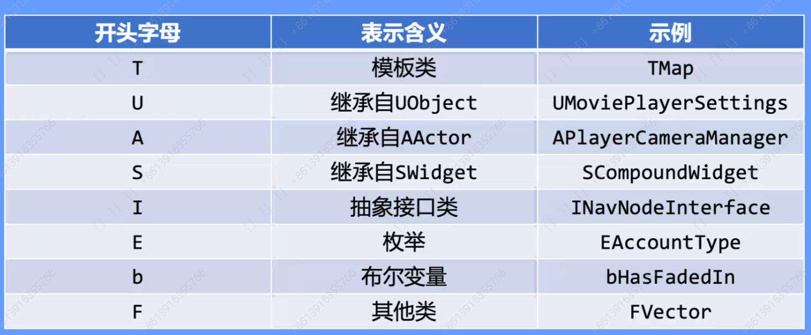

# Week3

## 课程笔记

### 代码规范用处

提高可维护性，可读性。

降低复杂度。

### 代码规范

缩进4空格。

换行：用空行将代码段隔开。

关键逻辑添加注释。

### UE代码规范

变量名：大驼峰式，bool类型需要加b前缀。

必须遵守的命名规范：

数据类型：

​	基础类型：

​	变量名声明时后面加:1，例如：uint8 bNetTemporary:1；。功能是只用1bit保存该变量，用来替代bool值，但是只能用在类里的变	量声明中，同样如果是:uint8，就表示用uint8大小来存储。

​	容器类：避免使用stl，使用UE自定义的TArray/TMap等。

​	字符串类：使用UE自定义的FString/FText/FName/TCHAR等。

代码风格：

​	大括号换行。

​	if-else要在一列里对齐。

​	使用Tab缩进。

​	switch-case语句都要break，然后所有的case要用大括号包起来。

命名空间：

​	UnrealHeaderTool仅支持全局命名空间的类型。

​	不要在全局命名空间使用using声明。

​	一些宏在命名空间内可能失效，可以尝试使用UE_前缀的版本。

C++11：

​	使用nullptr表示空指针。

​	Lambda函数显式指出返回类型。

​	不要使用auto，除了Lambda函数、迭代器声明、模版中类型推导。

### 如何写规范代码

使用辅助工具，如Cpplint，Resharper C++等。

### UE5中的标识符

详解文档：[UnrealSpecifiers/Doc/zh/Main.md at main · fjz13/UnrealSpecifiers](https://github.com/fjz13/UnrealSpecifiers/blob/main/Doc/zh/Main.md)

UPROPERTY：

​	EditAnywhere：c++代码，编辑器里都可以修改。

​	VisableAnywhere：只能在c++代码里修改，编辑器里只能查看值不能修改。

​	Category：为这个变量添加一个目录分类，中间加|可以创建二级菜单。

​	DisplayName：显示在编辑器里的变量名，用来和代码里的变量名作区分。

​	DisplayPriority：用来设置编辑器里显示的变量的优先级，默认的是你的声明顺序。

​	AdvancedDisplay：让编辑器里显示该变量的时候默认是折叠的。

​	ClampMin/Max：变量数值的上下限，当你在编辑器里输入超过这个范围的数据时，会自动被限定在这个范围内。

​	BlueprintReadOnly：蓝图里只读。

​	BlueprintReadWrite：蓝图里读写均可。

UFUNCTION：

​	BlueprintCallable：蓝图里可以调用该函数。

​	Meta函数默认值

UCLASS：

​	模块名(全大写)_API表示该模块可以被其他模块访问。

​	需要GENERATED_BODY()。

​	构造函数里最好不要做太多的事情，如分配大量的内存。如果只在运行时使用，可以在生命周期里如BeginPlay里进行初始化。

USTRUCT：

​	模块名(全大写)_API表示该模块可以被其他模块访问。

​	需要GENERATED_USTRUCT_BODY()。

​	用来存数据结构。

UENUM：

​	建议使用enum class。

## 课程作业	

实现一些标识符功能。