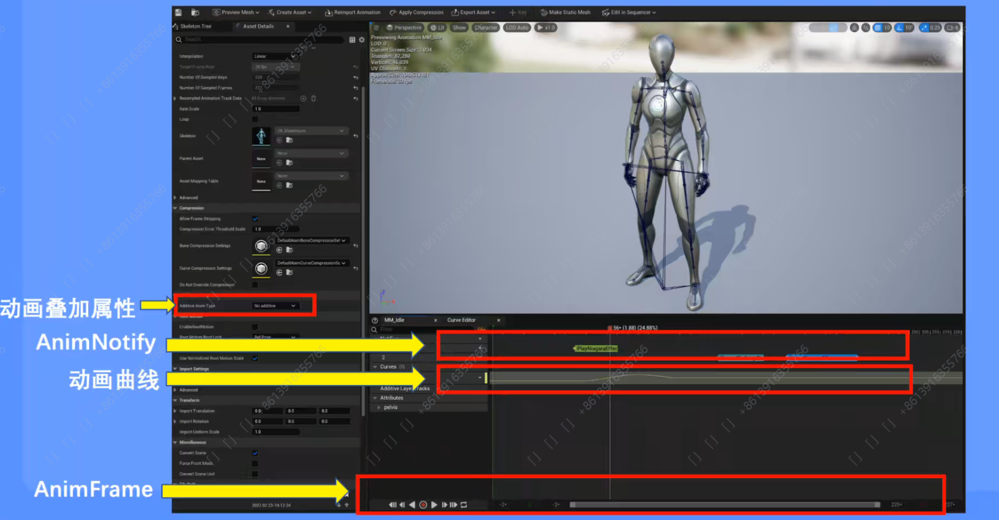

# Week5

## 骨骼动画

### 骨骼

互相连接的骨骼组成的骨架结构，通过改变骨骼的朝向和位置来生成动画

### 蒙皮

将Mesh连接到骨骼，由骨骼驱动Mesh进行运动

### 基础资产类型

Skeleton：骨架，定义了骨骼的层级结构。

SkeletalMesh：骨骼网络体，主要的渲染资源。

PhysicsAsset：物理资产，关联各骨骼和物理世界的交互。

### 动画蓝图

Event Graph：与普通蓝图的Event Graph类似。

Anim Graph：用于逐帧生成动画Pose。

### Animation Sequence

由一系列关键帧组成的动画序列，也是最基本的动画类型。

Local Space: Pose中保存的每个骨骼的变换数据为相对父骨骼的变换。

Mesh Space: Pose中保存的每个骨骼的变换数据为相对骨骼模型组建的变换。

Blend Space: 提供了多动画融合功能，通过传入参数值动态计算各个动画的权重输出融合后的结果。

Aim Offset: 是Blend Space的一个子集。

Montage: 蒙太奇，可以由若干个Animation Sequence组成，可以实现一些特殊的动画控制。

### 常用动画节点

混合节点：混合多种动画。

空间转换：组件到本地和本地到组件的空间转换，一般不常用。

状态机：提供了图形化的方法来控制动画的切换，比如姿态切换。状态之间可以设置转换条件以及转换融合的相关数据。

### IK 逆向动力学

Two Bone IK: 

FABRIK: 前向反向迭代IK。

### 资源获取

Epic商城

adobe mixamo

## 作业

实现敌人的基础移动蓝图；

实现敌人的死亡动画，添加多方向死亡动画；

实现近战击败敌人的功能和动画实现。
