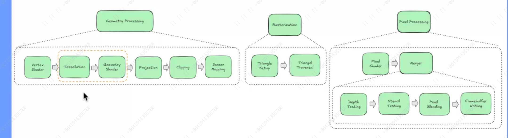
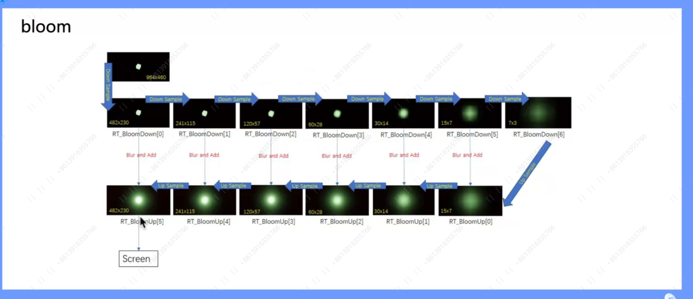

# Week6

## 渲染基础

### 图形管线

渲染：将三维场景中的模型，按照设定好的环境、灯光、材质及渲染参数，二维投影成数字图像的过程。

怎么渲染：GPU管线，即光栅化；光线追踪管线。

GPU管线原理：每个像素应该是什么颜色，进行计算后返回颜色。
光线追踪原理：视线打到的位置按照光线进行计算，多次计算反射后返回颜色。

图形管线流程：

几何处理流程：

1. 顶点着色器：将3d顶点坐标转变为基于世界的2d顶点坐标，即mvp；

2. 细分着色器（可选）：增加顶点和细节；

3. 几何着色器（可选）：顶点变换为完全不同的图元，生成和删除顶点；

4. 投影：游戏中主要使用透视投影，正交投影一般用在编辑器中；

5. 剪裁和屏幕映射：对于不在视锥内的顶点进行剪裁，然后将原本归一化好的顶点位置映射到不同的屏幕尺寸上（会包含深度信息，以进行深度测试）。

投影在几何着色器之后的原因： 投影变换不是线性变换，投影后不能再对其使用着色器了。

光栅化：

1. 建立三角形
2. 三角形转换：会产生锯齿问题，需要抗锯齿

像素处理：

1. 像素着色器，也叫片段着色器（Fragment Shader）；
2. 合并：深度测试，模版测试，像素混合，帧缓冲区写入。

CPU：准备并绑定资源，切换状态开关，发布绘制/计算指令。

### 模型和纹理

模型：有序排列的点集，会附带其他信息，如法/切向量，顶点色，UV。

纹理放大：就近取值，线性插值，二次插值；

纹理缩小：

1. Mipmapping：逐级生成缩小的纹理，如原纹理是1024 * 1024，就会逐级生成512 * 512，256 * 256等，缺点是会占用更多的内存（会比原内存多1/3）。
2. Summed Area Table（SAT）

Level of Detail（LOD）：不同等级下可以保存不同数量的细节。

Nanite：用虚拟化几何体来显示场景。

**UE中材质蓝图开发技巧：数字键+鼠标左键可以快速创建对应维度的向量节点，右键可以将其转化为参数节点**

### 光照和阴影

光照：方向光（如太阳）；点光；聚光灯（锥型）。

阴影：Shadow Map。

### 后处理

bloom：用于对发光物体产生泛光的效果。

### 渲染调试

可视化界面

统计命令：

1. stat unit：各步骤用时
2. stat rhi：各线程耗时；
3. stat scenerendering：查看当前视口性能情况。

Render Doc：插件，可以截取一帧，查看相关内容。

## 作业

增加阴影

Renderdoc分析游戏

增加一个渲染feature（如描边等）或者优化当前的渲染功能

### 推荐书

Fundamentals of Computer Graphics；Real-Time Rendering；Physically Based Rendering From Theory To Implementation
